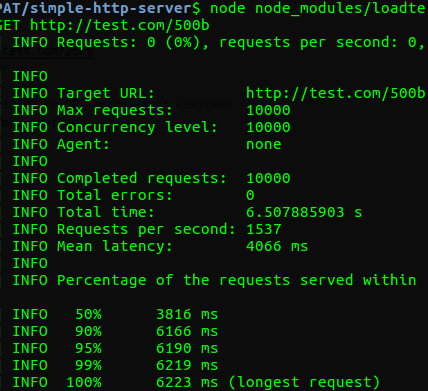
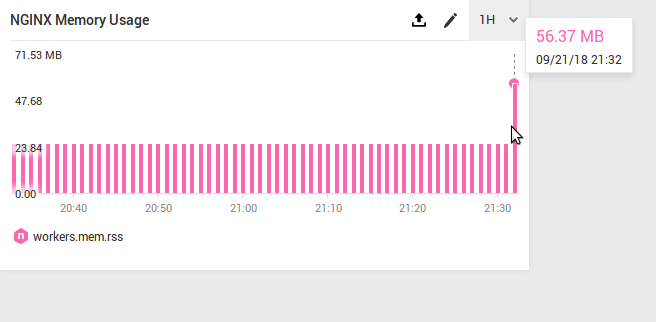
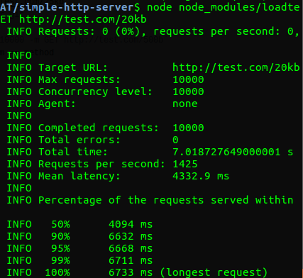
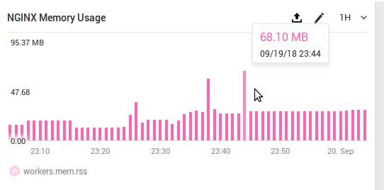
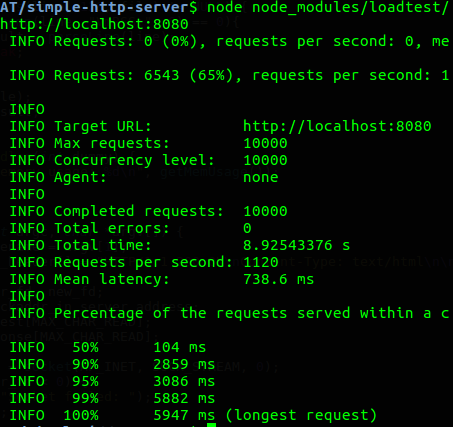
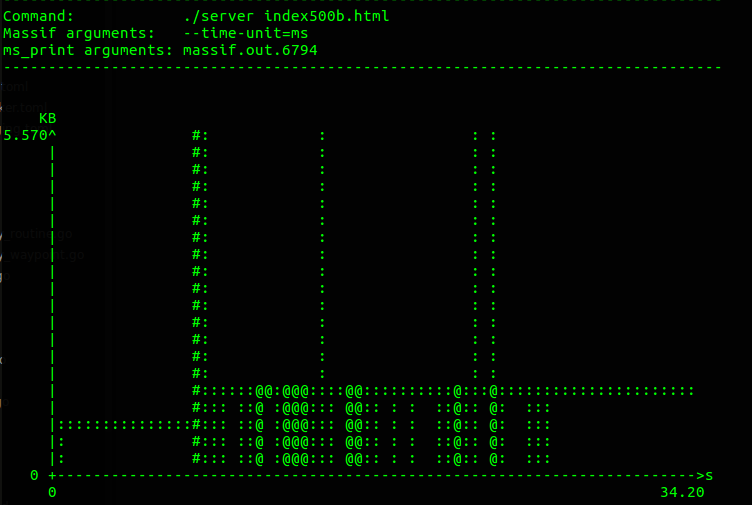
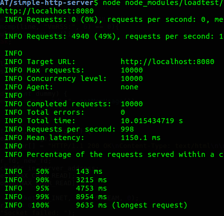
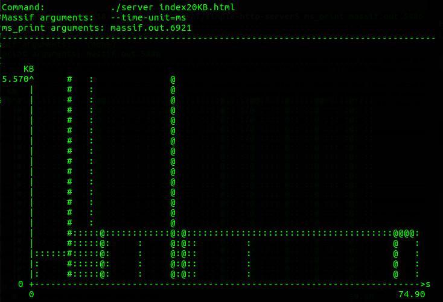

# simple-http-server

### Author
- Gianfranco F. H. 13515118
- Stevanno Hero L. 13515082

### Benchmarking NGINX
- Tools: 
  - https://github.com/alexfernandez/loadtest
  - https://amplify.nginx.com
- How to load test: 
  - Download Nginx (https://www.nginx.com/)
  - Copy all files in /config to your machine.
  - Make sure that you can access www.test.com/500b and www.test.com/25kb
  - `git clone git@github.com:stevannohero/simple-http-server.git`
  - `npm install`
  - `node node_modules/loadtest/bin/loadtest.js -n 10000 -c 10000 -m GET http://test.com/500b`
  - -n == num of request, -c == num of concurrent request, -m == method
- Result
  - 500 byte HTML file
  
    
    
    
  - 20 KB HTML file
  
    
    

### Benchmarking Simple Webserver in C
- Tools:
  - https://github.com/alexfernandez/loadtest
  - Socket library in C
  - http://valgrind.org
- How to load test:
  - `sudo apt-get valgrind`
  - `git clone git@github.com:stevannohero/simple-http-server.git`
  - `npm install`
  - `make`
  - `make run-500b` or `make run-25kb`
  - `node node_modules/loadtest/bin/loadtest.js -n 10000 -c 10000 -m GET http://localhost:8080`
  - -n == num of request, -c == num of concurrent request, -m == method
  - To show memusage: `ms_print massif.out.__`
 Result
  - 500 byte HTML file
  
    
    
    
  - 20 KB HTML file
  
    
    

### Perhitungan
- Benchmarking NGINX
  - 500b = 6.0578 x 10^-4 sec/request
  - 20KB = 7.0187 x 10^-4 sec/request
- Benchmarking C
  - 500b = 8.9254 x 10^-4 sec/request
  - 20KB = 10.0154 x 10^-4 sec/request
  
    
